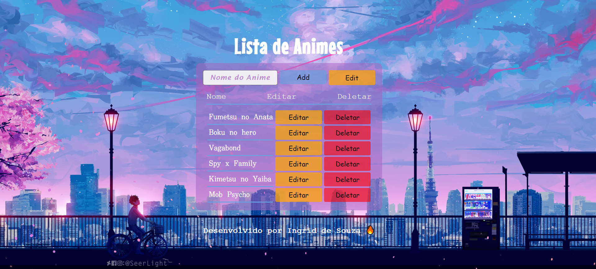

# Lista de Animes - CRUD.
Desenvolvi um site como uma lista, onde deposito todos os animes que conheço.

° O site é feito utilizando Fetch Api e CRUD;

° Nele podemos adicionar, editar e remover os animes da lista.

° As opções de editar, remover e adicionar só funcionam a partir de um localhost.

° Para isso, você deve baixar os arquivos e utilizar os comandos de npm para instalar e observar os arquivos.

º Foi utilizado as linguagens HTML, CSS e Javascript puro.

## Table of contents

- [Screenshot](#screenshot)
- [Links](#links)
- [Author](#author)

### Screenshot

### Links

- Solution URL: [Solution here](https://ingridssilveira.github.io/Lista_Animes/)

## Author

- Website - [Ingrid Souza](https://ingridssilveira.github.io/IngridSouza)
- GitHub - [@IngridsSilveira](https://github.com/IngridsSilveira)
